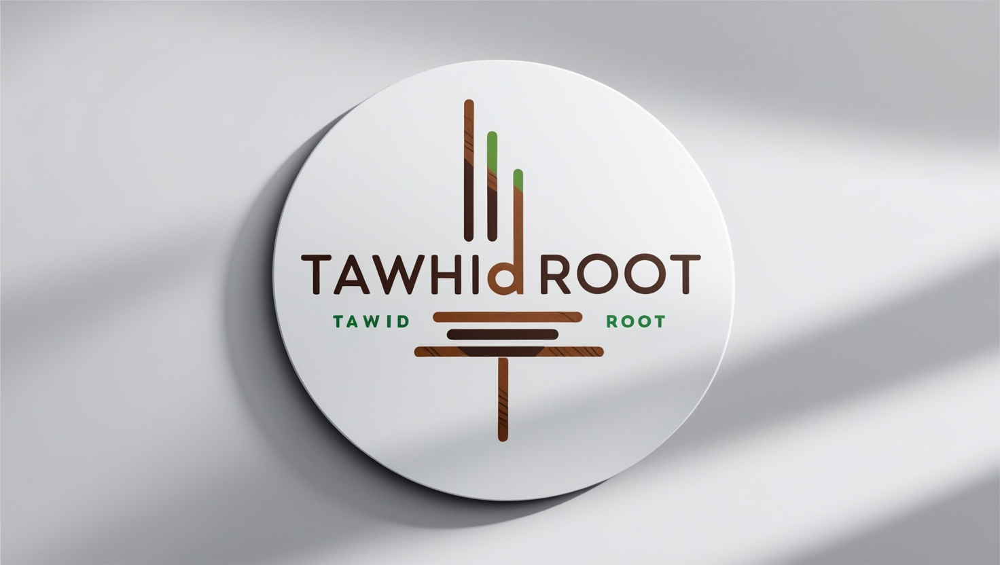

  

# Hi there, I'm Tawhid 👋

I'm a passionate student from Bangladesh with a love for technology and a big dream of creating AI that works like the human brain. I'm on a journey to learn as much as I can about coding and artificial intelligence while building projects that help me get closer to my goal.

## 🧑‍💻 About Me
- 🌱 **Currently learning:** HTML, CSS, JavaScript, Tailwind CSS
- 💡 **Dream project:** To create human-like AI that can think and reason like humans
- 📚 **Education:** Class 7 student
- 💻 **PC Specifications:**
  - Processor: Intel Core i5 10th Gen (10400) @ 2.9 GHz
  - Motherboard: Gigabyte H410-S2H
  - RAM: 8GB DDR4 3200Hz (Corsair Vengeance RGB Pro)
  - Graphics: Gigabyte GT 1030 2GB DDR5
  - OS: Windows 11 Pro (Version 23H2)
- 📱 **Phone:** POCO M3 (4GB RAM, 125GB Storage)

## ⚡ Skills
- **Web Development:** 
  - HTML, CSS, JavaScript
  - Tailwind CSS for modern UI designs
- **Learning Path:** Constantly exploring new technologies to enhance my knowledge and skills.

## 🌟 Goals
- **Short-term:** Master the fundamentals of web development and dive deeper into AI technologies.
- **Long-term:** Develop AI systems that can think like a human brain, pushing the boundaries of what's possible in artificial intelligence.

## 🚀 What I'm working on
- Building small projects with HTML, CSS, and JavaScript to improve my front-end development skills.
- Exploring artificial intelligence and machine learning concepts to prepare for my dream project.

## 💡 Fun Fact
I'm fascinated by how AI can change the future, and I believe with enough effort, we can build machines that truly understand and mimic human thought.

## 📫 Get in touch
- You can connect with me here on GitHub, and feel free to follow my progress as I work towards achieving my dream!
